# FitData Coach

> An explainable fitness analytics product backed by a real data-engineering architecture.

**English** · [Deutsch](README_DE.md) · [Recruiter guide](docs/RECRUITER_GUIDE.md) · [Recruiter report](docs/RECRUITER_REPORT.md)

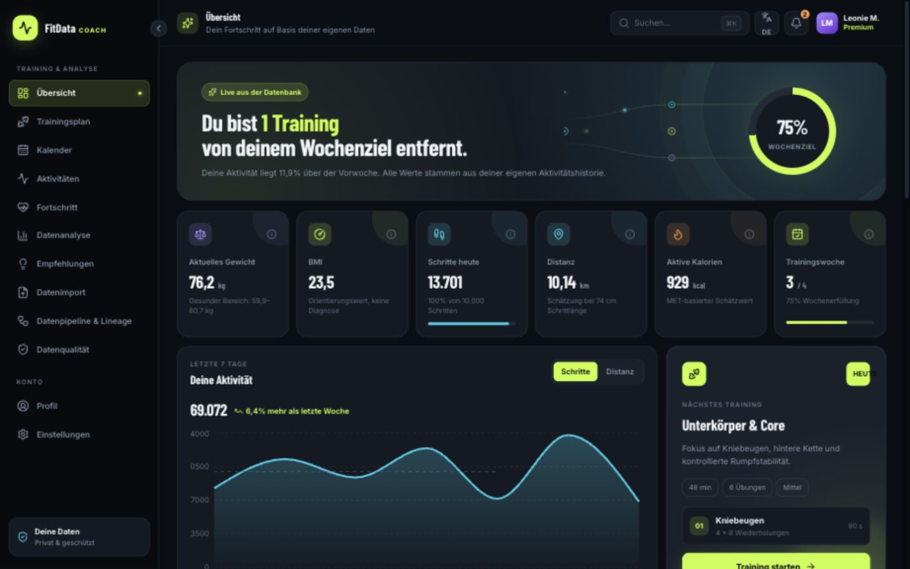

FitData Coach is a portfolio project at the intersection of **data engineering, backend development, analytics and product-focused frontend engineering**. It turns synthetic activity and health data into transparent metrics, deterministic workout plans and observable data pipelines.

> All demo data is synthetic. Calculations are informational estimates and are not medical advice.

## Recruiter fast scan

| Area | Evidence in this repository |
|---|---|
| Product engineering | 13 responsive product surfaces, reusable components, localization boundaries and accessible interaction patterns |
| Data engineering | Immutable raw ingestion, validation and quarantine, staging, dbt analytics models, lineage and pipeline observability |
| Backend | FastAPI contracts, Pydantic validation, Argon2 password hashing, JWT authentication and deterministic workout generation |
| Frontend | React 19, TypeScript, App Router pages, Recharts, Framer Motion, FullCalendar and XYFlow |
| Quality | Vitest, Testing Library, pytest, dbt tests, strict TypeScript, ESLint, rendered-HTML smoke tests and GitHub Actions |
| Delivery | Docker Compose stack for web, API, PostgreSQL, MinIO, Airflow and dbt |

## Product tour

The gallery is stored in the repository, so the product can be reviewed directly on GitHub without running the stack.

<table>
  <tr>
    <td width="50%">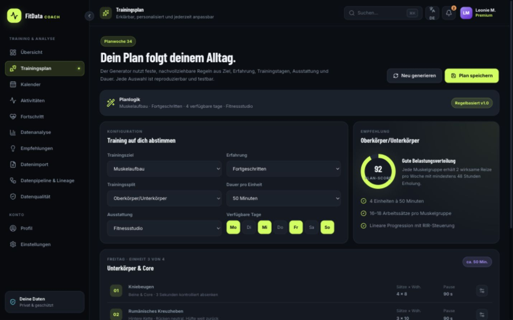<br><strong>Explainable workout plan</strong><br>Goal, experience, equipment, schedule and duration drive a deterministic plan.</td>
    <td width="50%">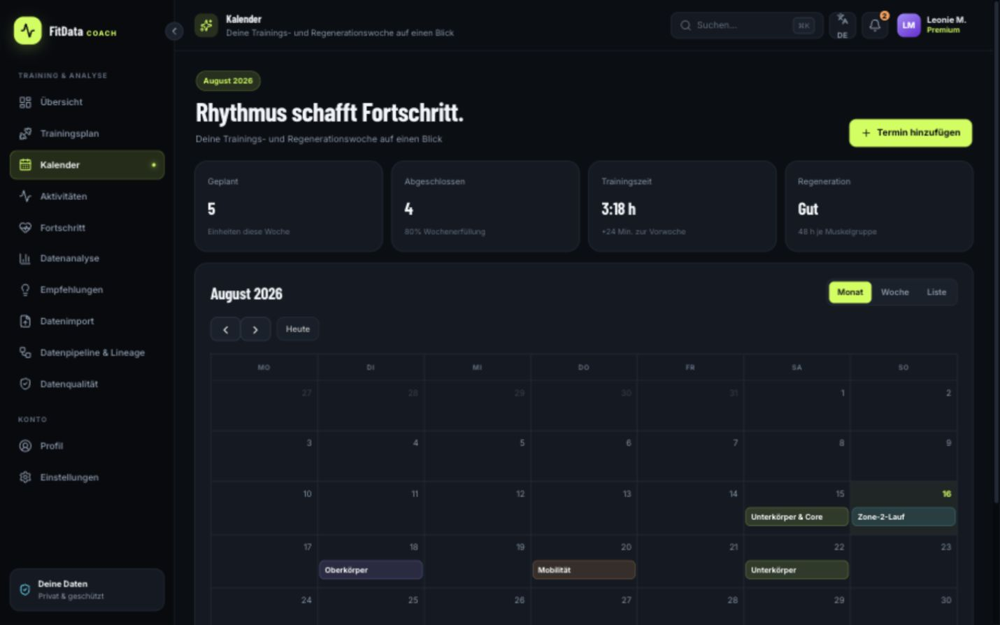<br><strong>Training calendar</strong><br>Planned sessions, completed workouts and recovery are visible in one place.</td>
  </tr>
  <tr>
    <td>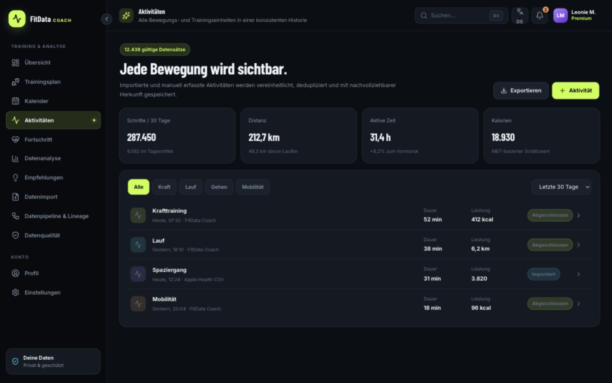<br><strong>Activity history</strong><br>Filterable workout and movement records with source and completion status.</td>
    <td>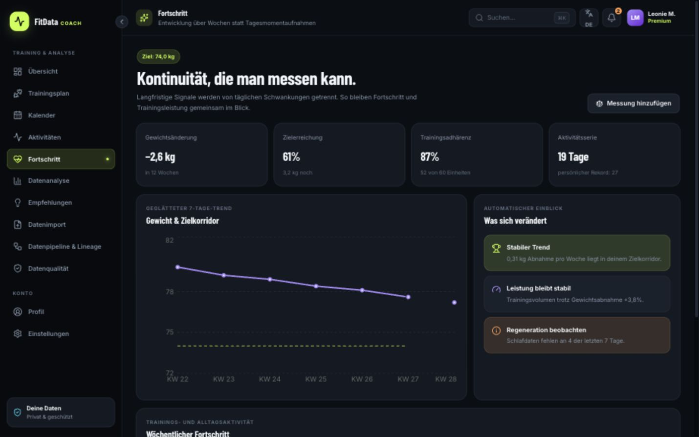<br><strong>Progress analytics</strong><br>Weight, adherence and training consistency reveal long-term trends.</td>
  </tr>
  <tr>
    <td>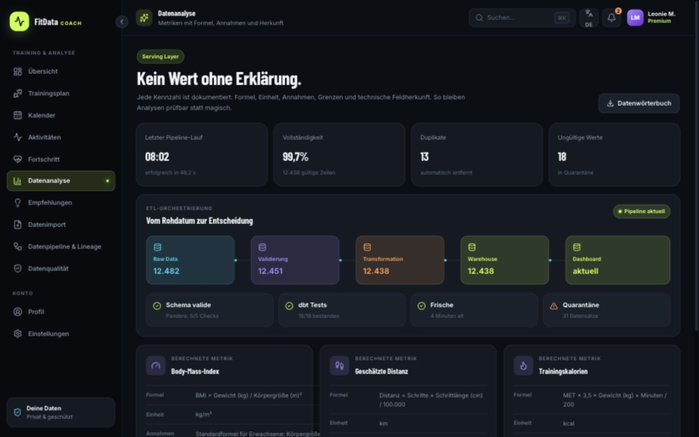<br><strong>Explainable metrics</strong><br>Formula, unit, assumptions, limitations and source lineage accompany calculated values.</td>
    <td>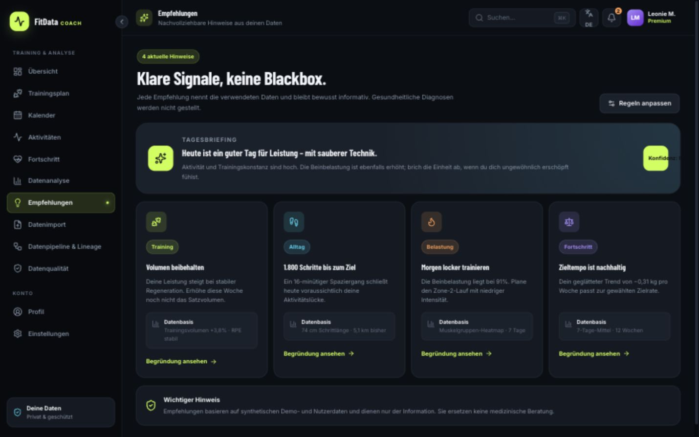<br><strong>Rule-based recommendations</strong><br>Each suggestion includes the evidence that triggered it.</td>
  </tr>
  <tr>
    <td>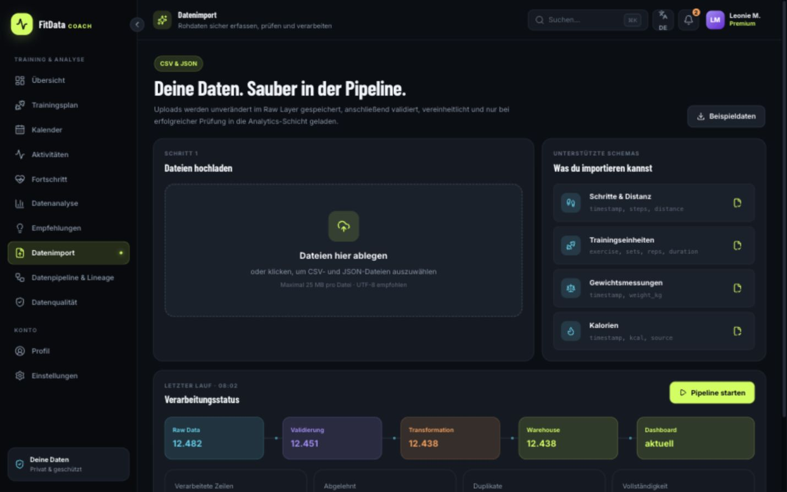<br><strong>Data import contract</strong><br>CSV/JSON schemas, immutable raw storage and validation feedback.</td>
    <td>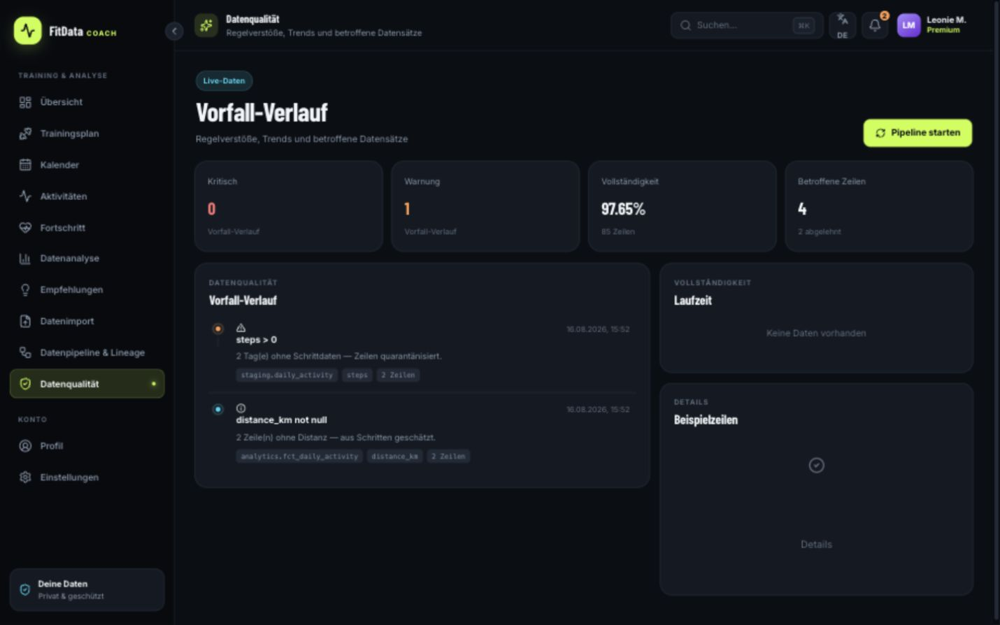<br><strong>Data quality</strong><br>Completeness, rejected rows and rule violations stay visible and auditable.</td>
  </tr>
  <tr>
    <td>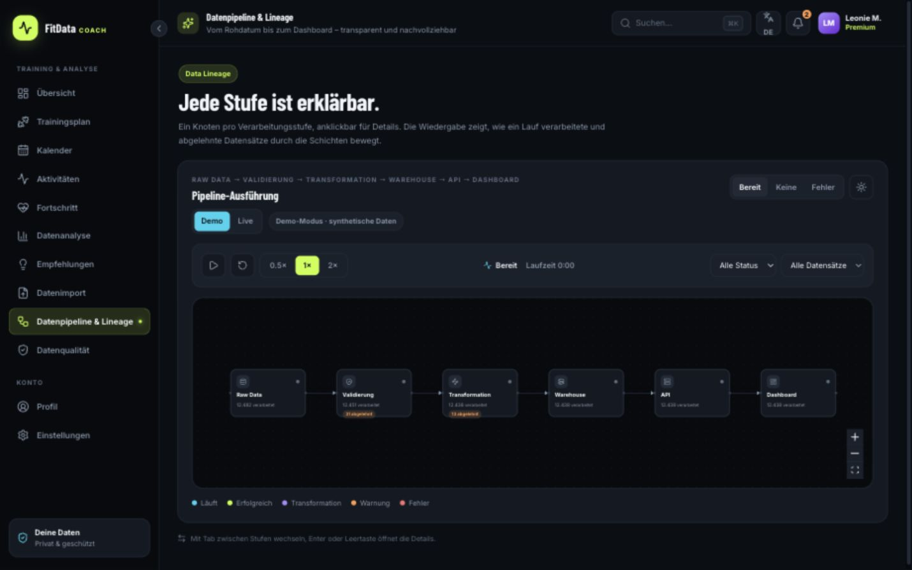<br><strong>Pipeline lineage</strong><br>Raw, validation, transformation, warehouse, API and dashboard stages are traceable.</td>
    <td>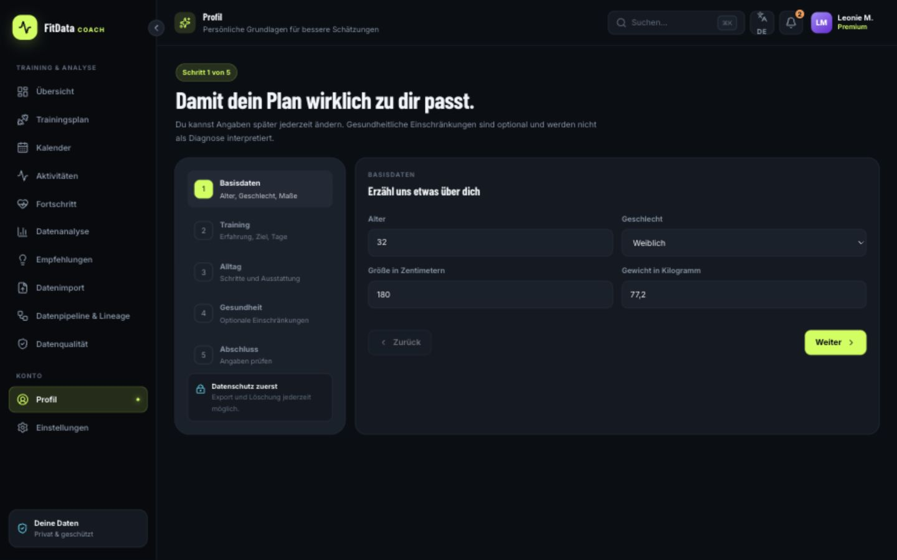<br><strong>Profile and onboarding</strong><br>Personal inputs are bounded, transparent and separated from generated estimates.</td>
  </tr>
  <tr>
    <td>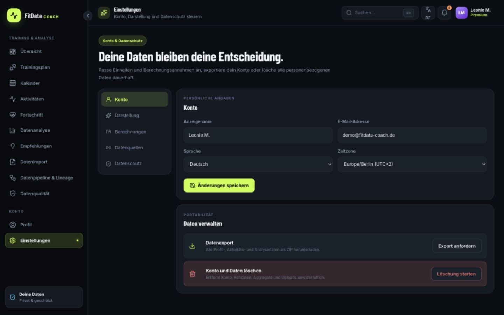<br><strong>Privacy-aware settings</strong><br>Units, notifications, data controls and account actions share one surface.</td>
    <td>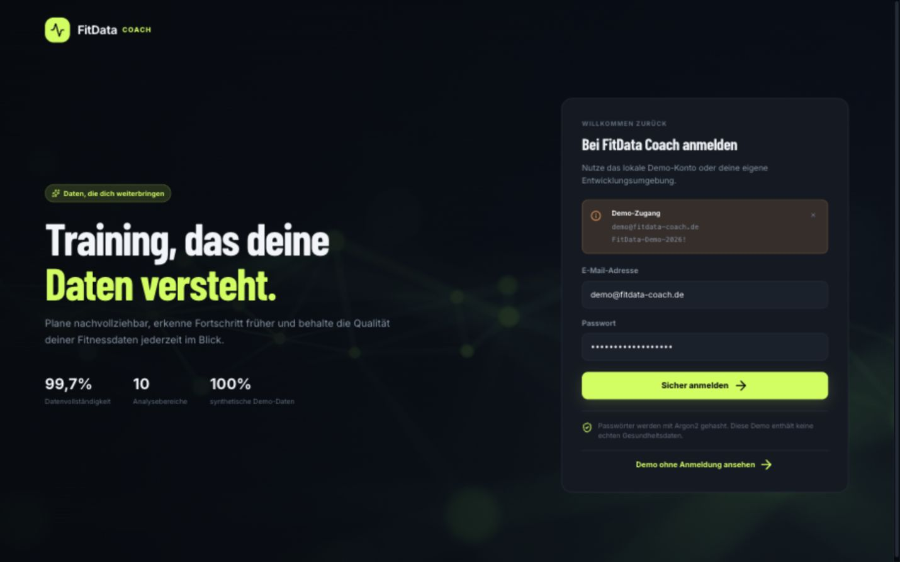<br><strong>Secure local demo access</strong><br>The sign-in surface documents synthetic data and password protection clearly.</td>
  </tr>
</table>

## Why this project exists

Fitness dashboards often show polished numbers without explaining where they came from. FitData Coach treats **data trust as a product feature**:

- raw uploads remain immutable;
- invalid rows are quarantined with a reason;
- transformations and tests are explicit;
- every calculated metric exposes its assumptions and lineage;
- recommendations use reproducible rules instead of opaque claims;
- the UI separates implemented demo behavior from roadmap integrations.

## Architecture

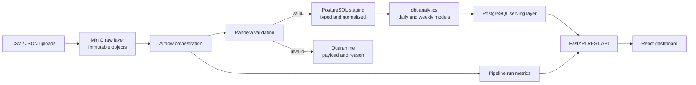

### Layer responsibilities

1. **Raw** preserves original bytes and ingestion metadata in MinIO and PostgreSQL.
2. **Staging** standardizes timestamps and units, deduplicates activities and rejects impossible measurements.
3. **Analytics** uses dbt to build daily activity, weekly adherence and latest-measurement models.
4. **Serving** exposes stable authentication, profile, metric, workout, import, dashboard and pipeline contracts through FastAPI.
5. **Presentation** turns serving data into responsive product surfaces and explainable visualizations.

## Technology stack

| Layer | Technologies |
|---|---|
| Web | React 19, TypeScript, Next.js App Router surface, vinext/Vite, Recharts, Framer Motion, FullCalendar, XYFlow |
| API | Python 3.12, FastAPI, Pydantic, SQLAlchemy, Argon2, JWT |
| Data platform | PostgreSQL, MinIO, Airflow, Pandera, dbt |
| Testing | Vitest, Testing Library, pytest, dbt tests, rendered HTML smoke tests |
| Operations | Docker Compose, GitHub Actions, environment-based configuration |

## Implementation status

| Capability | Status |
|---|---|
| Responsive product UI and visualizations | Implemented and build-tested with synthetic demo data |
| Fitness formulas | Implemented in TypeScript and Python with matching reference tests |
| Deterministic workout generator | Implemented and unit-tested as `rules-v1` |
| Authentication and profile API | Implemented with Argon2, JWT and validated inputs |
| Raw file ingestion contract | Implemented for bounded CSV/JSON uploads and MinIO storage |
| Airflow, Pandera and dbt project code | Implemented; full execution requires the Docker stack |
| Frontend persistence/API integration | Partial; several polished interactions currently demonstrate the intended contract |
| External fitness-provider synchronization | Roadmap; no external OAuth or real health data is included |

This status table is intentionally explicit: a polished interaction is not presented as a completed production integration.

## Quick start

### Frontend demo

Requirements: Node.js 22.13 or newer.

```bash
npm ci
npm run dev
```

Open the local URL printed by the development server, normally <http://localhost:3000>.

### Complete Docker stack

Requirements: Docker Compose v2 and at least 6 GB of available memory.

```bash
cp .env.example .env
docker compose up --build
```

| Service | URL |
|---|---|
| Web application | <http://localhost:3000> |
| FastAPI / Swagger UI | <http://localhost:8000/docs> |
| Airflow | <http://localhost:8080> |
| MinIO console | <http://localhost:9001> |
| PostgreSQL | `localhost:5432` |

Run dbt separately through the optional profile:

```bash
docker compose --profile transform run --rm dbt
```

### Synthetic demo credentials

```text
Email:    demo@fitdata-coach.de
Password: FitData-Demo-2026!
```

Change every default value before using the stack in a shared environment.

## Quality gates

```bash
npm run lint
npm run typecheck
npm test
npm run test:smoke

python -m venv .venv
source .venv/bin/activate
pip install -e './backend[data,test]'
PYTHONPATH="$PWD/backend:$PWD" pytest backend/tests
```

The CI workflow runs frontend linting, strict type checks, component and calculation tests, the production smoke build, backend tests and Docker Compose configuration validation.

## Repository map

```text
app/                 Product routes and layouts
components/          Dashboard, shared shell and feature surfaces
lib/                 Frontend calculations, fixtures and localization
backend/             FastAPI application, services and tests
pipeline/            Pandera validation and normalization
airflow/dags/        Scheduled ETL orchestration
dbt/                 Staging and analytics models/tests
db/init/             PostgreSQL schemas and layer tables
data/sample/         Synthetic CSV and JSON fixtures
docs/                API, lineage and recruiter documentation
screenshots/         Versioned recruiter-facing product tour
```

## Documentation

- [Recruiter guide — English](docs/RECRUITER_GUIDE.md)
- [Recruiter guide — German](docs/RECRUITER_GUIDE_DE.md)
- [Recruiter report — English](docs/RECRUITER_REPORT.md)
- [Recruiter report — German](docs/RECRUITER_REPORT_DE.md)
- [API contracts](docs/API.md)
- [Metric lineage and assumptions](docs/DATA_LINEAGE.md)
- [Screenshot catalogue](screenshots/README.md)
- [Contributing guide](CONTRIBUTING.md)
- [Security policy](SECURITY.md)

## Privacy and safety

- All included records are synthetic; no real health data belongs in this repository.
- Passwords are stored only as Argon2 hashes.
- Uploads are limited by type and size and retain ownership metadata.
- Calculations are estimates with explicit assumptions and limitations.
- Account deletion covers relational user data; raw-object retention orchestration remains a documented production gap.

## Roadmap

- Complete authenticated frontend/API persistence and error states.
- Add Alembic migrations and PostgreSQL integration tests.
- Complete MinIO raw-object deletion and retention jobs.
- Add containerized browser end-to-end journeys and accessibility budgets.
- Add opt-in provider connectors only after a privacy and OAuth threat review.

## License

This project is available under the terms in [LICENSE](LICENSE).
