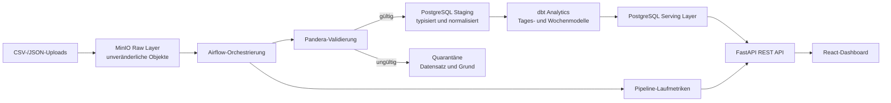

# FitData Coach

> Ein nachvollziehbares Fitness-Analyseprodukt auf Basis einer echten Data-Engineering-Architektur.

[English](README.md) · **Deutsch** · [Recruiter-Leitfaden](docs/RECRUITER_GUIDE_DE.md) · [Recruiter-Bericht](docs/RECRUITER_REPORT_DE.md)


FitData Coach ist ein Portfolio-Projekt an der Schnittstelle von **Data Engineering, Backend-Entwicklung, Analytics und produktorientierter Frontend-Entwicklung**. Synthetische Aktivitäts- und Gesundheitsdaten werden in transparente Kennzahlen, deterministische Trainingspläne und beobachtbare Datenpipelines übersetzt.

> Alle Demo-Daten sind synthetisch. Berechnungen sind informative Schätzwerte und keine medizinische Beratung.

## Schnellüberblick für Recruiter

| Bereich | Nachweis in diesem Repository |
|---|---|
| Produktentwicklung | 13 responsive Produktoberflächen, wiederverwendbare Komponenten, vorbereitete Lokalisierung und zugängliche Interaktionsmuster |
| Data Engineering | Unveränderliche Raw-Ingestion, Validierung und Quarantäne, Staging, dbt-Modelle, Lineage und Pipeline-Beobachtbarkeit |
| Backend | FastAPI-Verträge, Pydantic-Validierung, Argon2-Passwort-Hashing, JWT-Authentifizierung und deterministische Trainingsplanung |
| Frontend | React 19, TypeScript, App-Router-Seiten, Recharts, Framer Motion, FullCalendar und XYFlow |
| Qualität | Vitest, Testing Library, pytest, dbt-Tests, striktes TypeScript, ESLint, HTML-Smoke-Tests und GitHub Actions |
| Bereitstellung | Docker-Compose-Stack für Web, API, PostgreSQL, MinIO, Airflow und dbt |

## Produkt-Tour

Die Galerie liegt direkt im Repository. Das Produkt kann deshalb auf GitHub betrachtet werden, ohne den Stack lokal zu starten.

<table>
  <tr>
    <td width="50%"><br><strong>Nachvollziehbarer Trainingsplan</strong><br>Ziel, Erfahrung, Ausstattung, Trainingstage und Dauer führen zu einem deterministischen Plan.</td>
    <td width="50%"><br><strong>Trainingskalender</strong><br>Geplante Einheiten, abgeschlossene Trainings und Regeneration sind gemeinsam sichtbar.</td>
  </tr>
  <tr>
    <td><br><strong>Aktivitätsverlauf</strong><br>Filterbare Trainings- und Bewegungsdaten mit Quelle und Abschlussstatus.</td>
    <td><br><strong>Fortschrittsanalyse</strong><br>Gewicht, Planerfüllung und Trainingskonstanz machen langfristige Trends sichtbar.</td>
  </tr>
  <tr>
    <td><br><strong>Erklärbare Kennzahlen</strong><br>Formel, Einheit, Annahmen, Grenzen und Datenherkunft begleiten berechnete Werte.</td>
    <td><br><strong>Regelbasierte Empfehlungen</strong><br>Jede Empfehlung nennt die Daten, durch die sie ausgelöst wurde.</td>
  </tr>
  <tr>
    <td><br><strong>Datenimport-Vertrag</strong><br>CSV-/JSON-Schemata, unveränderliche Raw-Speicherung und Validierungsfeedback.</td>
    <td><br><strong>Datenqualität</strong><br>Vollständigkeit, abgelehnte Zeilen und Regelverstöße bleiben sichtbar und prüfbar.</td>
  </tr>
  <tr>
    <td><br><strong>Pipeline-Lineage</strong><br>Raw-, Validierungs-, Transformations-, Warehouse-, API- und Dashboard-Stufen sind nachvollziehbar.</td>
    <td><br><strong>Profil und Onboarding</strong><br>Persönliche Eingaben sind begrenzt, transparent und von berechneten Schätzwerten getrennt.</td>
  </tr>
  <tr>
    <td><br><strong>Datenschutzorientierte Einstellungen</strong><br>Einheiten, Benachrichtigungen, Datenkontrollen und Kontoaktionen an einem Ort.</td>
    <td><br><strong>Sicherer lokaler Demo-Zugang</strong><br>Die Anmeldung weist klar auf synthetische Daten und Passwortschutz hin.</td>
  </tr>
</table>

## Warum dieses Projekt existiert

Fitness-Dashboards zeigen häufig ansprechende Zahlen, ohne deren Herkunft zu erklären. FitData Coach behandelt **Datenvertrauen als Produktfunktion**:

- Raw-Uploads bleiben unverändert;
- ungültige Zeilen werden mit Begründung in Quarantäne verschoben;
- Transformationen und Tests sind explizit;
- jede berechnete Kennzahl zeigt Annahmen und Datenherkunft;
- Empfehlungen folgen reproduzierbaren Regeln;
- die Oberfläche trennt implementiertes Demo-Verhalten von geplanten Integrationen.

## Architektur



### Aufgaben der Schichten

1. **Raw** bewahrt Originalbytes und Ingestion-Metadaten in MinIO und PostgreSQL auf.
2. **Staging** vereinheitlicht Zeitstempel und Einheiten, entfernt Duplikate und lehnt unmögliche Messwerte ab.
3. **Analytics** erzeugt mit dbt Tagesaktivität, wöchentliche Planerfüllung und aktuelle Messdimensionen.
4. **Serving** stellt stabile Verträge für Anmeldung, Profil, Kennzahlen, Training, Import, Dashboard und Pipeline über FastAPI bereit.
5. **Presentation** übersetzt Serving-Daten in responsive Produktoberflächen und erklärbare Visualisierungen.

## Technologie-Stack

| Schicht | Technologien |
|---|---|
| Web | React 19, TypeScript, Next.js-App-Router-Oberfläche, vinext/Vite, Recharts, Framer Motion, FullCalendar, XYFlow |
| API | Python 3.12, FastAPI, Pydantic, SQLAlchemy, Argon2, JWT |
| Datenplattform | PostgreSQL, MinIO, Airflow, Pandera, dbt |
| Tests | Vitest, Testing Library, pytest, dbt-Tests, gerenderte HTML-Smoke-Tests |
| Betrieb | Docker Compose, GitHub Actions, umgebungsbasierte Konfiguration |

## Implementierungsstand

| Funktion | Status |
|---|---|
| Responsive Produktoberfläche und Visualisierungen | Mit synthetischen Demo-Daten implementiert und Build-getestet |
| Fitnessformeln | In TypeScript und Python mit übereinstimmenden Referenztests implementiert |
| Deterministischer Trainingsgenerator | Als `rules-v1` implementiert und Unit-getestet |
| Authentifizierungs- und Profil-API | Mit Argon2, JWT und validierten Eingaben implementiert |
| Raw-Datei-Ingestion | Für begrenzte CSV-/JSON-Uploads und MinIO-Speicherung implementiert |
| Airflow-, Pandera- und dbt-Projektcode | Implementiert; vollständige Ausführung benötigt den Docker-Stack |
| Frontend-Persistenz/API-Integration | Teilweise; mehrere ausgearbeitete Interaktionen demonstrieren aktuell den vorgesehenen Vertrag |
| Synchronisierung externer Fitnessanbieter | Roadmap; kein externes OAuth und keine realen Gesundheitsdaten enthalten |

Diese Statustabelle ist bewusst eindeutig: Eine ausgearbeitete Interaktion wird nicht als fertige Produktionsintegration dargestellt.

## Schnellstart

### Frontend-Demo

Voraussetzung: Node.js 22.13 oder neuer.

```bash
npm ci
npm run dev
```

Danach die vom Entwicklungsserver ausgegebene lokale URL öffnen, normalerweise <http://localhost:3000>.

### Vollständiger Docker-Stack

Voraussetzungen: Docker Compose v2 und mindestens 6 GB freier Arbeitsspeicher.

```bash
cp .env.example .env
docker compose up --build
```

| Dienst | URL |
|---|---|
| Webanwendung | <http://localhost:3000> |
| FastAPI / Swagger UI | <http://localhost:8000/docs> |
| Airflow | <http://localhost:8080> |
| MinIO-Konsole | <http://localhost:9001> |
| PostgreSQL | `localhost:5432` |

dbt wird separat über das optionale Profil gestartet:

```bash
docker compose --profile transform run --rm dbt
```

### Synthetischer Demo-Zugang

```text
E-Mail:   demo@fitdata-coach.de
Passwort: FitData-Demo-2026!
```

Vor einer Nutzung in einer geteilten Umgebung müssen alle Standardwerte geändert werden.

## Qualitätsprüfungen

```bash
npm run lint
npm run typecheck
npm test
npm run test:smoke

python -m venv .venv
source .venv/bin/activate
pip install -e './backend[data,test]'
PYTHONPATH="$PWD/backend:$PWD" pytest backend/tests
```

Die CI prüft Frontend-Linting, strikte Typen, Komponenten und Berechnungen, den Produktions-Smoke-Build, Backend-Tests und die Docker-Compose-Konfiguration.

## Repository-Struktur

```text
app/                 Produktrouten und Layouts
components/          Dashboard, gemeinsame Shell und Funktionsseiten
lib/                 Frontend-Berechnungen, Fixtures und Lokalisierung
backend/             FastAPI-Anwendung, Services und Tests
pipeline/            Pandera-Validierung und Normalisierung
airflow/dags/        Geplante ETL-Orchestrierung
dbt/                 Staging-/Analytics-Modelle und Tests
db/init/             PostgreSQL-Schemata und Schichttabellen
data/sample/         Synthetische CSV- und JSON-Fixtures
docs/                API-, Lineage- und Recruiter-Dokumentation
screenshots/         Versionierte Produkt-Tour für Recruiter
```

## Dokumentation

- [Recruiter-Leitfaden — Deutsch](docs/RECRUITER_GUIDE_DE.md)
- [Recruiter-Leitfaden — Englisch](docs/RECRUITER_GUIDE.md)
- [Recruiter-Bericht — Deutsch](docs/RECRUITER_REPORT_DE.md)
- [Recruiter-Bericht — Englisch](docs/RECRUITER_REPORT.md)
- [API-Verträge](docs/API.md)
- [Kennzahlen-Lineage und Annahmen](docs/DATA_LINEAGE.md)
- [Screenshot-Katalog](screenshots/README.md)
- [Beitragsleitfaden](CONTRIBUTING.md)
- [Sicherheitsrichtlinie](SECURITY.md)

## Datenschutz und Sicherheit

- Alle mitgelieferten Datensätze sind synthetisch; reale Gesundheitsdaten gehören nicht in dieses Repository.
- Passwörter werden ausschließlich als Argon2-Hashes gespeichert.
- Uploads sind nach Typ und Größe begrenzt und behalten Eigentümer-Metadaten.
- Berechnungen sind Schätzwerte mit expliziten Annahmen und Grenzen.
- Die Kontolöschung umfasst relationale Nutzerdaten; die Löschung und Aufbewahrung von Raw-Objekten bleibt eine dokumentierte Produktionslücke.

## Roadmap

- Authentifizierte Frontend-/API-Persistenz und Fehlerzustände vervollständigen.
- Alembic-Migrationen und PostgreSQL-Integrationstests ergänzen.
- Lösch- und Aufbewahrungsjobs für MinIO-Raw-Objekte abschließen.
- Containerisierte Browser-E2E-Tests und Barrierefreiheitsbudgets einführen.
- Anbieter-Konnektoren erst nach Datenschutz- und OAuth-Bedrohungsanalyse hinzufügen.

## Lizenz

Dieses Projekt steht unter den Bedingungen in [LICENSE](LICENSE) zur Verfügung.
